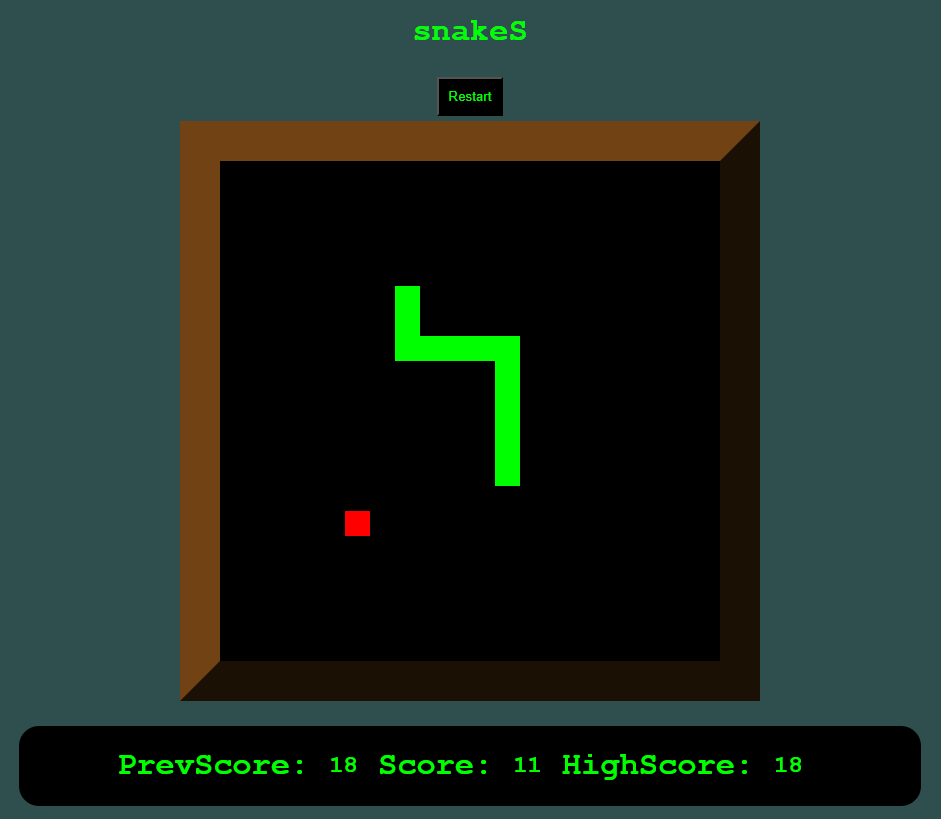

# snake
Retro snake game project using plain JS,HTML, and CSS.  
  
Snake is a sub-genre of action video games where the player maneuvers the end of a growing line, often themed as a snake. The player must keep the snake from colliding with both other obstacles and itself, which gets harder as the snake lengthens. It originated in the 1976 two-player arcade video game Blockade from Gremlin Industries where the goal is to survive longer than the other player.  
This particular version of snake allows players to reach the edge of the map, meaning that a player only loses when they collide with themselves.  

